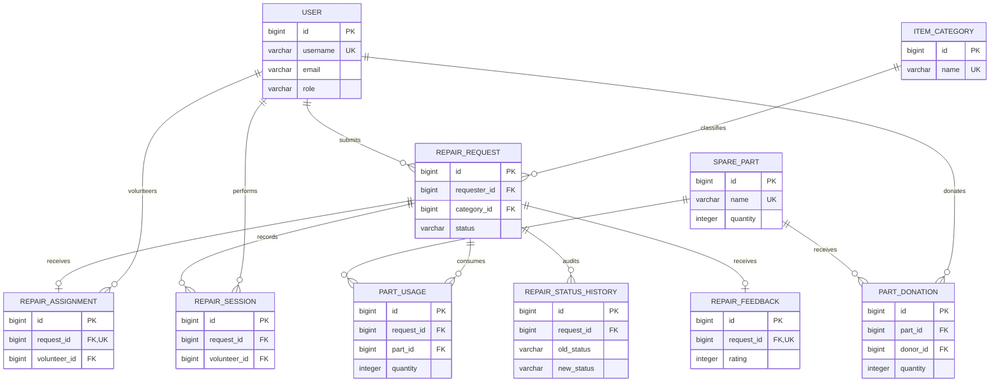

# Entity relationship diagram

```mermaid
erDiagram
    USER ||--o{ REPAIR_REQUEST : submits
    ITEM_CATEGORY ||--o{ REPAIR_REQUEST : classifies
    REPAIR_REQUEST ||--o| REPAIR_ASSIGNMENT : receives
    USER ||--o{ REPAIR_ASSIGNMENT : volunteers
    REPAIR_REQUEST ||--o{ REPAIR_SESSION : records
    USER ||--o{ REPAIR_SESSION : performs
    SPARE_PART ||--o{ PART_DONATION : receives
    USER ||--o{ PART_DONATION : donates
    SPARE_PART ||--o{ PART_USAGE : consumed_in
    REPAIR_REQUEST ||--o{ PART_USAGE : consumes
    REPAIR_REQUEST ||--o{ REPAIR_STATUS_HISTORY : audits
    REPAIR_REQUEST ||--o| REPAIR_FEEDBACK : receives
    USER {
      bigint id PK
      varchar username UK
      varchar email
      varchar role
    }
    ITEM_CATEGORY { bigint id PK
      varchar name UK }
    REPAIR_REQUEST { bigint id PK
      bigint requester_id FK
      bigint category_id FK
      varchar status }
    REPAIR_ASSIGNMENT { bigint id PK
      bigint request_id FK,UK
      bigint volunteer_id FK }
    REPAIR_SESSION { bigint id PK
      bigint request_id FK
      bigint volunteer_id FK }
    SPARE_PART { bigint id PK
      varchar name UK
      integer quantity }
    PART_DONATION { bigint id PK
      bigint part_id FK
      bigint donor_id FK
      integer quantity }
    PART_USAGE { bigint id PK
      bigint request_id FK
      bigint part_id FK
      integer quantity }
    REPAIR_STATUS_HISTORY { bigint id PK
      bigint request_id FK
      varchar old_status
      varchar new_status }
    REPAIR_FEEDBACK { bigint id PK
      bigint request_id FK,UK
      integer rating }
```

`User.role` stores requester, volunteer, or coordinator; these are not separate user tables. Django's own framework tables are outside the ten application entities.
